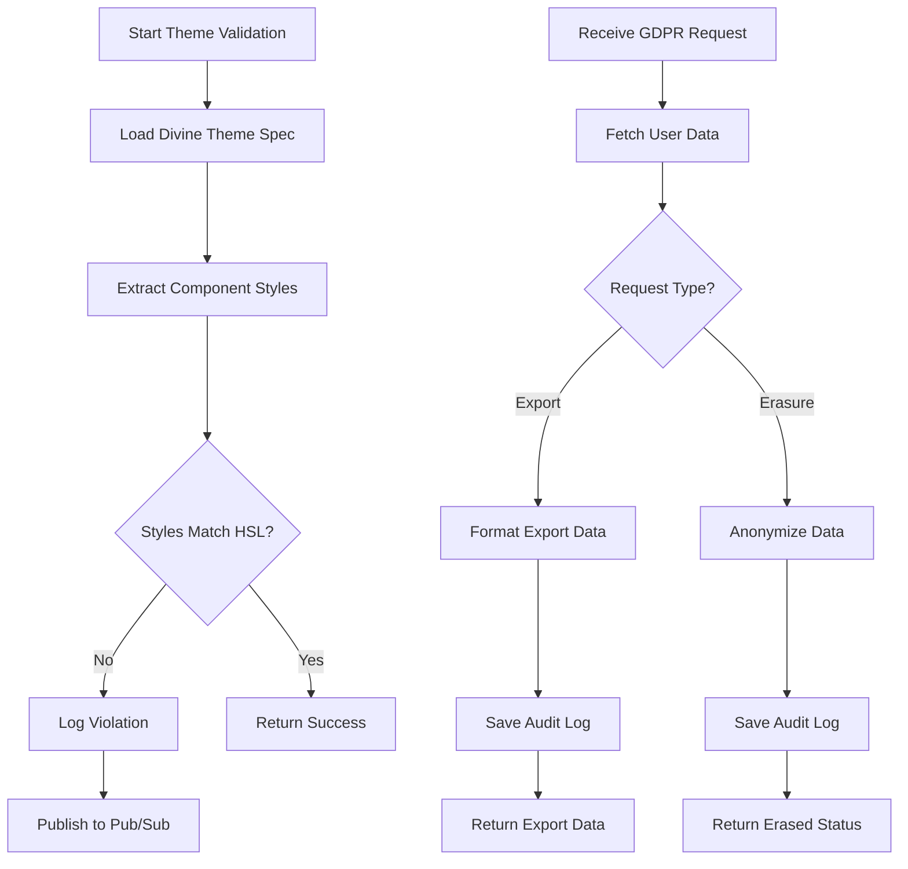
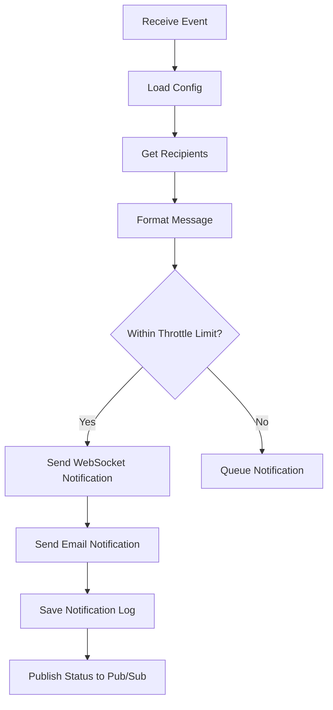
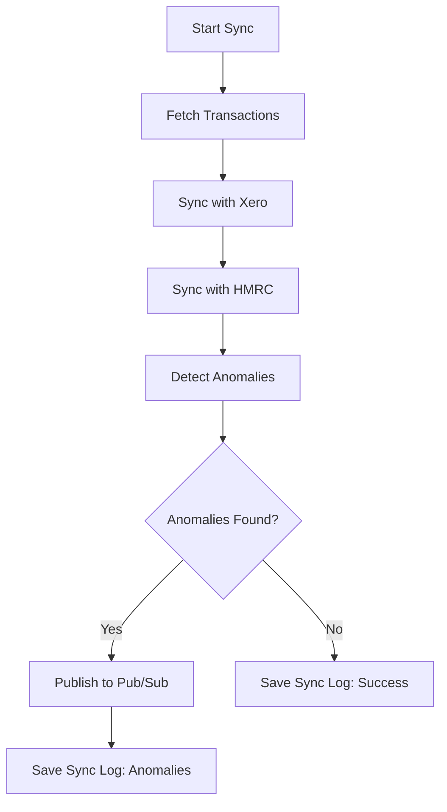
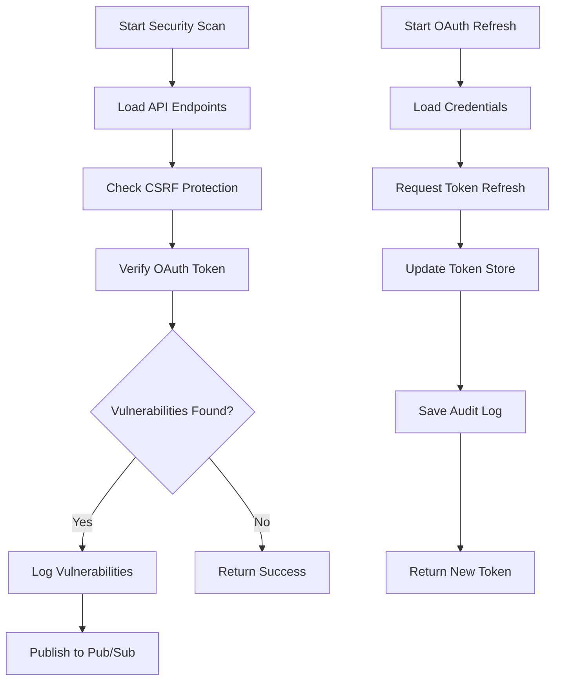
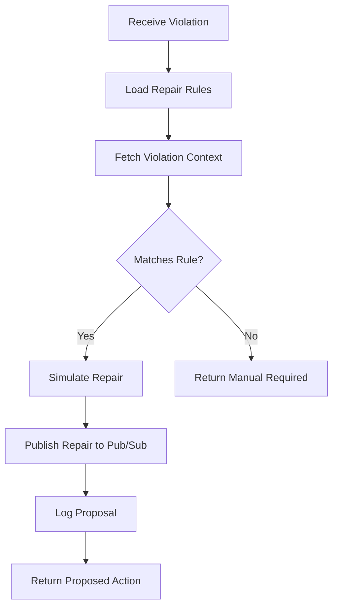

# MercuryOne Agent Communication Protocol (CRITICAL)

## Navigation
- For system overview: [MercuryOne_System_Overview.md](../Overviews/MercuryOne_System_Overview.md)
- For technical architecture: [MercuryOne_Technical_Architecture.md](MercuryOne_Technical_Architecture.md)
- For business logic: [MercuryOne_Core_Business_Logic.md](../Business_Logic/MercuryOne_Core_Business_Logic.md)
- For suppliers: [MercuryOne_Supplier_Architecture_Guide.md](../Suppliers/MercuryOne_Supplier_Architecture_Guide.md)
- For integrations: [Morpheus_Integration_Guide.md](../Integrations/Morpheus_Integration_Guide.md)
- For roadmaps: [MercuryOne_Development_Roadmap.csv](../Roadmaps/MercuryOne_Development_Roadmap.csv)
- For compliance: [MercuryOne_UK_Compliance_Guide.md](../Compliance/MercuryOne_UK_Compliance_Guide.md)

---

**Last Updated:** August 11, 2025
**Status:** ✅ CRITICAL BUSINESS DOCUMENTATION — Protected from deletion
**Classification:** Core operational framework for all MercuryOne agents

---

## CHANGE LOG
- **2025-08-11**: ESTABLISHED AS AUTHORITATIVE SOURCE - All patch assignments must follow this protocol
- **2025-08-11**: Fixed 41 agent assignment violations in CSV roadmap to match canonical roles
- **2025-08-11**: Confirmed 14 total agents (11 MercuryOne including Jupiter + 3 Morpheus exclusive)
- **2025-08-06**: ELEVATED TO CRITICAL STATUS - Protected core operational documentation
- **2025-08-06**: Renamed to AGENT_COMMUNICATION_PROTOCOL for clarity and importance
- **2025-07-31**: Purged all legacy agent implementations and consolidated into canonical MercuryRising agents
- **2025-07-31**: Updated agent roles and responsibilities to align with current roadmap
- **2025-07-31**: Removed deprecated references and cleaned documentation structure
- **2025-07-31**: Confirmed alignment with MercuryRising_README.md and project documentation

---

## 🔁 Current Agent Overview (v2.6.3)

**AUTHORITATIVE SOURCE**: This table defines the canonical agent assignments for all patches and features.

**Total Agents**: 14 (11 MercuryOne including Jupiter + 3 Morpheus exclusive)

| **Agent**    | **Role**                                                                 | **App**    |
| ------------ | ------------------------------------------------------------------------ | ---------- |
| **Jupiter**  | Master controller, agent orchestrator, system log aggregator             | MercuryOne |
| **Janus**    | Lifecycle compliance, passport validator, audit trail enforcement        | MercuryOne |
| **Juno**     | Document schema validation and intake routing                            | MercuryOne |
| **Saturn**   | Delay alerting, Slack/email notifications, agent-phase dispatches        | MercuryOne |
| **Athena**   | UI drift detection, GDPR enforcement, visual compliance auditing         | MercuryOne |
| **Vulcan**   | Auto-repair suggestions, lifecycle violation remediation                 | MercuryOne |
| **Hercules** | Patch validation, roadmap regression testing, README enforcement         | MercuryOne |
| **Mars**     | CSRF/session/OAuth enforcement, Gmail/Xero login guard, security audit   | MercuryOne |
| **Neptune**  | Xero ledger sync, VAT compliance validation, financial anomaly detection | MercuryOne |
| **Minerva**  | Frontend crash detection, hydration issues, telemetry enrichment         | MercuryOne |
| **Apollo**   | CI diagnostics, API testing, external webhook validation                 | MercuryOne |
| **Iris**     | Mobile/email document intake, scan normalization, confidence scoring     | Morpheus   |
| **Argus**    | OCR, schema enrichment, lifecycle trigger to Janus/Saturn/Juno           | Morpheus   |
| **Daedalus** | Schema memory & enrichment, supplier pattern learning, confidence mapping | Morpheus   |

---

## 📌 Role-by-Agent Detail (Post-Migration)

### Jupiter (MercuryOne)

* Orchestration of agent cycles via `.mcp-agentrc.json`
* Dispatch scheduler and patch telemetry aggregator

### Janus (MercuryOne)

* Passport lifecycle gatekeeper and status transition validator
* PO/delivery/invoice match compliance with document linkage
* Audit enforcement and lifecycle rule validation
* **Janus → Iris Error Feedback Channel**: Direct communication to Morpheus for failed lifecycle transitions and document processing errors
* **POS Integration & Product Lifecycle**: Manages product availability during POS transactions
  - Enforces product lifecycle rules during POS product selection
  - Validates product options and customizations during sales process
  - Coordinates with Product Creator for hierarchical product management
  - Maintains product range assignments and bulk operations audit trail
  - Integrates CSV-imported products into POS workflow with proper compliance checks

### Juno (MercuryOne)

* Schema validation for inbound docs
* Intake routing for Acknowledgement, Invoice, PO
* **Product Creation & CSV Import**: Primary validator for CSV product imports
  - Validates CSV schema compliance against product table structure
  - Performs field-level validation (SKU uniqueness, price formats, category mappings)
  - Routes validated product data to appropriate database handlers
  - Coordinates with Daedalus for supplier schema enrichment from price lists
  - Manages auto-creation of suppliers and categories from CSV data

### Saturn (MercuryOne)

* Delay tracker and notification dispatch (Slack/email)
* Agent phase escalations (e.g. overdue delivery trigger)
* **Product Import Notifications**: Manages CSV import completion and error notifications
  - Dispatches import success/failure notifications to stakeholders
  - Escalates failed CSV imports requiring manual review
  - Coordinates low-stock threshold alerts for newly imported products
  - Manages product range assignment completion notifications

### Athena (MercuryOne)

* Divine Theme enforcer, visual drift scanner
* GDPR compliance validator
* UI audit + field consistency validation

### Vulcan (MercuryOne)

* Proposes UI/data repairs on violations
* Runs lifecycle auto-fix pass on flagged entries
* Absorbed schema repair from `agent-maintain.ts`

### Hercules (MercuryOne)

* Validates README.md format + roadmap alignment
* Regression and patch compliance test runner
* Responsible for stopping build on roadmap/test violations

### Mars (MercuryOne)

* OAuth token validator, CSRF enforcer
* Xero and Gmail login guards
* Performs Mars-level security audit from `.mars-scan.json`
* **CSV Import Security**: Enforces security controls for external data imports
  - Validates CSV file origins and prevents malicious uploads
  - Performs session-based access control for product import functionality
  - Scans CSV content for injection attacks and data integrity threats
  - Enforces user permissions for bulk product operations and range assignments
  - Coordinates with Juno to ensure secure schema-compliant data processing

### Neptune (MercuryOne)

* VAT rate enforcement + ledger reconciliation
* Handles all Xero sync logic
* Manages invoice validation, contact mapping, return logic
* **Financial Validation for Products**: Ensures pricing and tax compliance for imported products
  - Validates cost/selling price formats and reasonable margin calculations
  - Enforces UK VAT rate compliance (20% default) for all product imports
  - Coordinates with Xero for product pricing synchronization
  - Manages supplier trade discount validation from CSV imports
  - Performs financial audit checks on bulk price updates and range assignments

### Minerva (MercuryOne)

* React hydration debugger
* Frontend crash telemetry and monitoring

### Apollo (MercuryOne)

* CI test suite coordinator
* External API contract and webhook validation
* Runs `agent-services.ts` and test logs

### Iris (Morpheus)

* Ingests QR/docs via mobile/email
* Extracts scans and performs format normalization
* Applies confidence scoring before OCR

### Argus (Morpheus)

* Runs OCR pipeline and applies schema
* Routes to Janus/Juno based on lifecycle readiness
* OCR processing and document classification with automated pattern recognition

### Daedalus (Morpheus) 

* Schema memory and enrichment engine for supplier-specific document patterns
* Progressive learning from structured documents (invoices, POs, delivery notes, price lists)
* Price List Interpreter Engine: Parses complex multi-column PDFs with table layout reconstruction
* Structured field extraction: SKU, name, finish, dimensions, RRP, trade_price using regex + NLP
* Maintains confidence mapping and field-level trust metrics with color-coded indicators (🟥🟨🟩) 
* Provides feedback loop for human corrections and schema retraining via mobile-optimized interface at /morpheus/inbox/:docId/feedback
* Stores persistent JSON schema with version history for rollback capabilities in /schemas/suppliers/{supplierId}.json
* **Product Creator Integration**: Bridges document automation with product catalog management
  - Enriches CSV imports with supplier-specific schema patterns and confidence scoring
  - Maps price list documents to Product Creator format (SKU, material, finish, dimensions)
  - Provides supplier schema templates for consistent CSV import validation
  - Coordinates with Juno for product schema compliance and data enrichment
  - Exports validated product schemas to MercuryOne Product Creator for seamless integration
* Interfaces: Receives from Argus/Iris, sends to Janus/Juno/Athena/Vulcan

---

## 🛍️ POS Integration & Product Lifecycle Workflows

### Product Creation to POS Pipeline

**Phase Integration**: Product Creator → POS Selection (via Janus)

1. **CSV Import Processing**:
   - Mars validates file security and user permissions
   - Juno performs schema validation and data integrity checks
   - Daedalus enriches import with supplier-specific patterns
   - Neptune validates pricing and VAT compliance
   - Saturn dispatches completion notifications

2. **POS Product Selection**:
   - Janus enforces product lifecycle rules during selection
   - Validates hierarchical product structure (Supplier > Range > Product)
   - Manages product options and customizations availability
   - Coordinates with Product Creator for real-time stock validation

3. **Lifecycle Enforcement**:
   - Products must pass all agent validations before POS availability
   - Range assignments and bulk operations require Janus lifecycle compliance
   - Product options management integrated with POS customization workflows

### Agent Coordination Matrix

| **Operation** | **Primary Agent** | **Supporting Agents** | **Lifecycle Phase** |
|---------------|-------------------|----------------------|-------------------|
| CSV Import Validation | Juno | Mars (security), Neptune (pricing) | Pre-POS |
| Product Schema Enrichment | Daedalus | Juno (validation) | Schema Learning |
| POS Product Selection | Janus | Juno (availability), Neptune (pricing) | POS Transaction |
| Import Notifications | Saturn | All agents (status reporting) | Post-Import |
| Range Management | Janus | Juno (validation), Saturn (notifications) | POS Configuration |

---

## ✅ Final Declaration

* This document reflects full absorption of all legacy logic into:

  * Canonical MercuryRising Agents
  * `.mcp-agentrc.json` agent orchestration
  * All recent patches and test formats

* No deprecated references remain.

* Confirmed alignment with:

  * `MercuryRising_README.md`
  * `Morpheus_README_Canonical.md`
  * `MercuryRising_DOCS.md`
  * `Project_Instructions.md`
  * `MercuryRising_Complete_Roadmap.csv`

# Agent Build Guides

This section provides detailed implementation guides for agents requiring specific build documentation, including pseudocode, configuration examples, and deployment notes.

## Athena Build Guide

### Overview
Athena enforces Divine Theme compliance across UI components and automates GDPR/DUAA data rights (export/erasure). This guide covers theme validation and compliance API implementation, enhanced with flowcharts, API schemas, and error-handling examples per industry standards.

### Build Details
#### Core Logic
Athena scans React components for HSL color compliance and provides GDPR-compliant data endpoints.

**Pseudocode**:
```javascript
// Divine Theme validation
function validateDivineTheme(components) {
  const themeSpec = loadThemeSpec('divine_theme_spec.json'); // HSL colors
  const violations = [];

  for (const component of components) {
    const styles = extractComponentStyles(component); // Parse CSS/JSX
    for (const style of styles) {
      if (!matchesHSL(style.color, themeSpec.hsl)) {
        violations.push({ component, style, expected: themeSpec.hsl });
      }
    }
  }

  if (violations.length > 0) {
    publishToPubSub('athena_violations', violations); // Notify Vulcan
    logDriftReport(violations);
  }
  return violations.length === 0;
}

// GDPR data rights endpoint
function handleDataRequest(userId, requestType) {
  const userData = fetchUserData(userId); // From PostgreSQL
  if (requestType === 'export') {
    const exportData = formatDataForExport(userData);
    saveAuditLog(userId, 'export', exportData);
    return exportData;
  } else if (requestType === 'erasure') {
    anonymizeUserData(userId);
    saveAuditLog(userId, 'erasure', { status: 'completed' });
    return { status: 'erased' };
  }
}
```

#### Flowchart
Visualizes the theme validation and GDPR request process.



#### API Schema
Athena exposes a GDPR data rights endpoint.

**OpenAPI Schema**:
```yaml
/api/gdpr:
  post:
    summary: Handle GDPR data requests (export/erasure)
    requestBody:
      content:
        application/json:
          schema:
            type: object
            properties:
              userId:
                type: string
                example: "USER123"
              requestType:
                type: string
                enum: ["export", "erasure"]
    responses:
      '200':
        description: Request processed successfully
        content:
          application/json:
            schema:
              type: object
              properties:
                status:
                  type: string
                  example: "erased"
                data:
                  type: object
                  nullable: true
      '404':
        description: User not found
```

#### Error-Handling Examples
Handles theme validation failures and GDPR request errors.

**Example**:
```javascript
try {
  const styles = extractComponentStyles(component);
  if (!styles) throw new Error('Failed to parse component styles');
  for (const style of styles) {
    if (!matchesHSL(style.color, themeSpec.hsl)) {
      throw new Error(`Style violation: ${style.color} does not match ${themeSpec.hsl}`);
    }
  }
} catch (error) {
  console.error(`Athena Theme Error: ${error.message}`);
  violations.push({ component, error: error.message });
  publishToPubSub('athena_error', { component, error: error.message });
}

try {
  const userData = fetchUserData(userId);
  if (!userData) throw new Error(`User not found: ${userId}`);
} catch (error) {
  console.error(`GDPR Error: ${error.message}`);
  saveAuditLog(userId, requestType, { error: error.message });
  return { status: 'error', message: error.message };
}
```

#### Configuration
Uses `.mcp-agentrc.json` for audit and API settings.

**Example `.mcp-agentrc.json`**:
```json
{
  "agent": "athena",
  "enabled": true,
  "themeConfig": {
    "specPath": "divine_theme_spec.json",
    "scanInterval": "12h"
  },
  "gdprConfig": {
    "auditTable": "gdpr_audits",
    "endpoint": "/api/gdpr"
  },
  "pubSub": {
    "topic": "athena_violations"
  }
}
```

#### Dependencies
- **Internal**: Vulcan (auto-repair, implied), Profile Management (Patch 000G).
- **External**: PostgreSQL/Drizzle (audit logs), Google Pub/Sub (notifications).
- **Libraries**: `css-parser` (style extraction), `express` (API endpoints).

#### Deployment Notes
- **Environment**: Deploy on Replit or Google Cloud Run with 2 vCPUs, 4GB RAM.
- **Scaling**: Schedule scans to avoid UI performance hits. Use rate-limiting for GDPR endpoints.
- **Testing**: Validate HSL compliance on 10+ UI pages; test export/erasure with mock user data per MercuryOne_UK_Compliance_Guide.md.

## Saturn Build Guide

### Overview
Saturn handles notification dispatching and alerting for MercuryOne agents (e.g., delays, violations). This guide provides build details, including pseudocode, flowchart, API schema, and error-handling examples to ensure unambiguous implementation, per Patch 093.

### Build Details
#### Core Logic
Saturn dispatches notifications via WebSocket and email, with throttling to prevent spam.

**Pseudocode**:
```javascript
// Notification dispatching
function dispatchNotification(event) {
  const config = loadConfig('notification_config.json'); // Throttling rules
  const recipients = getRecipients(event.type); // From PostgreSQL
  const message = formatMessage(event);

  if (isWithinThrottleLimit(event.type, config)) {
    sendWebSocketNotification(message, recipients); // Real-time alert
    sendEmailNotification(message, recipients); // Fallback
    saveNotificationLog(event, recipients, 'sent');
    publishToPubSub('saturn_status', { eventId: event.id, status: 'sent' });
  } else {
    queueNotification(event); // Throttle exceeded
  }
}
```

#### Flowchart
Visualizes the notification dispatch process.



#### API Schema
Saturn exposes a notification endpoint.

**OpenAPI Schema**:
```yaml
/saturn/notify:
  post:
    summary: Dispatch notification for system events
    requestBody:
      content:
        application/json:
          schema:
            type: object
            properties:
              eventId:
                type: string
                example: "EVENT123"
              type:
                type: string
                example: "violation"
    responses:
      '200':
        description: Notification dispatched
        content:
          application/json:
            schema:
              type: object
              properties:
                status:
                  type: string
                  example: "sent"
      '429':
        description: Throttle limit exceeded
```

#### Error-Handling Examples
Handles throttle limits and delivery failures.

**Example**:
```javascript
try {
  if (!isWithinThrottleLimit(event.type, config)) {
    throw new Error(`Throttle limit exceeded for ${event.type}`);
  }
} catch (error) {
  console.error(`Saturn Throttle Error: ${error.message}`);
  queueNotification(event, { error: error.message });
  publishToPubSub('saturn_error', { eventId: event.id, error: error.message });
}

try {
  sendWebSocketNotification(message, recipients);
} catch (error) {
  console.error(`WebSocket Error: ${error.message}`);
  saveNotificationLog(event, recipients, { status: 'failed', error: error.message });
  sendEmailNotification(message, recipients); // Fallback
}
```

#### Configuration
Example `.mcp-agentrc.json`:

```json
{
  "agent": "saturn",
  "enabled": true,
  "notificationConfig": {
    "configPath": "notification_config.json",
    "throttleLimit": "10/min",
    "websocketUrl": "ws://localhost:8080"
  },
  "pubSub": {
    "topic": "saturn_status"
  }
}
```

#### Dependencies
- **Internal**: Core Infrastructure (Patch 000A), Agent Build Documentation Generator (Patch 091).
- **External**: PostgreSQL/Drizzle (logs), Google Pub/Sub, WebSocket (`ws` library).
- **Libraries**: `nodemailer` (email), `node-postgres` (DB access).

#### Deployment Notes
- **Environment**: Deploy on Replit with 1 vCPU, 2GB RAM.
- **Scaling**: Use rate-limiting to prevent spam; configure Pub/Sub retries (Patch 084).
- **Testing**: Test with 10+ alert scenarios (e.g., violations, delays); verify WebSocket reliability.

## Neptune Build Guide

### Overview
Neptune manages VAT compliance and Xero ledger sync, ensuring financial accuracy. This guide provides build details, including pseudocode, flowchart, API schema, and error-handling examples, per Patch 094.

### Build Details
#### Core Logic
Neptune syncs financial data with Xero and HMRC, detecting anomalies.

**Pseudocode**:
```javascript
// Financial sync and anomaly detection
function syncFinancialData() {
  const transactions = fetchTransactions(); // From PostgreSQL
  const xeroData = syncWithXero(transactions); // Xero API
  const hmrcData = syncWithHMRC(xeroData); // HMRC MTD API

  const anomalies = detectAnomalies(xeroData, hmrcData); // Rule-based
  if (anomalies.length > 0) {
    publishToPubSub('neptune_anomalies', anomalies); // Notify Saturn
    saveSyncLog(transactions, { status: 'anomalies_detected', anomalies });
  } else {
    saveSyncLog(transactions, { status: 'success' });
  }
  return { status: anomalies.length > 0 ? 'anomalies' : 'success' };
}
```

#### Flowchart
Visualizes the financial sync process.



#### API Schema
Neptune exposes a sync endpoint.

**OpenAPI Schema**:
```yaml
/neptune/sync:
  post:
    summary: Sync financial data with Xero and HMRC
    responses:
      '200':
        description: Sync completed
        content:
          application/json:
            schema:
              type: object
              properties:
                status:
                  type: string
                  enum: ["success", "anomalies"]
                anomalies:
                  type: array
                  items:
                    type: object
                    example: { "transactionId": "TX123", "issue": "VAT mismatch" }
      '502':
        description: External API failure
```

#### Error-Handling Examples
Handles sync and anomaly detection failures.

**Example**:
```javascript
try {
  const xeroData = syncWithXero(transactions);
  if (!xeroData) throw new Error('Xero sync failed');
} catch (error) {
  console.error(`Neptune Sync Error: ${error.message}`);
  saveSyncLog(transactions, { status: 'failed', error: error.message });
  publishToPubSub('neptune_error', { error: error.message });
}

try {
  const anomalies = detectAnomalies(xeroData, hmrcData);
  if (anomalies.length > 0) throw new Error('Anomalies detected');
} catch (error) {
  console.error(`Neptune Anomaly Error: ${error.message}`);
  publishToPubSub('neptune_anomalies', anomalies);
}
```

#### Configuration
Example `.mcp-agentrc.json`:

```json
{
  "agent": "neptune",
  "enabled": true,
  "syncConfig": {
    "xeroApiKey": "XERO_KEY",
    "hmrcApiKey": "HMRC_KEY",
    "syncInterval": "24h"
  },
  "pubSub": {
    "topic": "neptune_anomalies"
  }
}
```

#### Dependencies
- **Internal**: Core Infrastructure (Patch 000A), Xero VAT MTD Updater (Patch 086), Agent Build Documentation Generator (Patch 091).
- **External**: Xero API, HMRC MTD API, PostgreSQL/Drizzle (logs), Google Pub/Sub.
- **Libraries**: `node-postgres`, `axios` (API calls).

#### Deployment Notes
- **Environment**: Deploy on Replit with 2 vCPUs, 4GB RAM.
- **Scaling**: Schedule syncs to avoid peak loads; use dead-letter queues (Patch 084).
- **Testing**: Test with 5+ Xero/HMRC sync scenarios; validate GDPR/VAT compliance.

## Mars Build Guide

### Overview
Mars enforces security by scanning for OAuth/CSRF vulnerabilities and securing external integrations (e.g., Gmail/Xero). This guide details scan logic and OAuth setup, enhanced with flowcharts, API schemas, and error-handling examples.

### Build Details
#### Core Logic
Mars runs scheduled scans and manages OAuth token refresh.

**Pseudocode**:
```javascript
// Security scan for vulnerabilities
function runSecurityScan() {
  const endpoints = loadEndpoints('api_config.json'); // All system APIs
  const vulnerabilities = [];

  for (const endpoint of endpoints) {
    const csrfResult = checkCSRFProtection(endpoint); // Check headers
    const oauthResult = verifyOAuthToken(endpoint); // Validate token expiry
    if (!csrfResult.valid || !oauthResult.valid) {
      vulnerabilities.push({ endpoint, issues: { csrf: csrfResult, oauth: oauthResult } });
    }
  }

  if (vulnerabilities.length > 0) {
    publishToPubSub('mars_alerts', vulnerabilities); // Notify Saturn
    logSecurityReport(vulnerabilities);
  }
  return vulnerabilities;
}

// OAuth token refresh
function refreshOAuthToken(service) {
  const credentials = loadCredentials(service); // e.g., Gmail/Xero
  const newToken = requestTokenRefresh(credentials);
  updateTokenStore(service, newToken);
  saveAuditLog(service, 'token_refresh', { status: 'success' });
  return newToken;
}
```

#### Flowchart
Visualizes the security scan and OAuth refresh process.



#### API Schema
Mars exposes an OAuth refresh endpoint.

**OpenAPI Schema**:
```yaml
/mars/oauth/refresh:
  post:
    summary: Refresh OAuth token for external services
    requestBody:
      content:
        application/json:
          schema:
            type: object
            properties:
              service:
                type: string
                enum: ["gmail", "xero"]
                example: "xero"
    responses:
      '200':
        description: Token refreshed successfully
        content:
          application/json:
            schema:
              type: object
              properties:
                token:
                  type: string
                  example: "new_token_123"
      '401':
        description: Invalid credentials
```

#### Error-Handling Examples
Handles scan failures and OAuth refresh errors.

**Example**:
```javascript
try {
  const csrfResult = checkCSRFProtection(endpoint);
  if (!csrfResult.valid) throw new Error(`CSRF protection missing for ${endpoint.url}`);
} catch (error) {
  console.error(`Mars Scan Error: ${error.message}`);
  vulnerabilities.push({ endpoint, error: error.message });
  publishToPubSub('mars_error', { endpoint, error: error.message });
}

try {
  const newToken = requestTokenRefresh(credentials);
  if (!newToken) throw new Error(`Token refresh failed for ${service}`);
} catch (error) {
  console.error(`OAuth Error: ${error.message}`);
  saveAuditLog(service, 'token_refresh', { error: error.message });
  return { status: 'error', message: error.message };
}
```

#### Configuration
**Example `.mcp-agentrc.json`**:
```json
{
  "agent": "mars",
  "enabled": true,
  "scanConfig": {
    "scanInterval": "6h",
    "endpointsPath": "api_config.json"
  },
  "oauthConfig": {
    "services": ["gmail", "xero"],
    "tokenStore": "security_tokens"
  },
  "pubSub": {
    "topic": "mars_alerts"
  }
}
```

#### Dependencies
- **Internal**: Saturn (notifications), Core Infrastructure (Patch 000A).
- **External**: OWASP ZAP (scanning), OAuth2 libraries (e.g., `passport`).
- **Libraries**: `express` (API security), `node-postgres` (audit logs).

#### Deployment Notes
- **Environment**: Deploy on Replit with 2 vCPUs, 4GB RAM.
- **Scaling**: Limit scan frequency to avoid resource spikes. Use dead-letter queues (Patch 084) for alert reliability.
- **Testing**: Simulate CSRF/OAuth failures; validate token refresh for Gmail/Xero.

## Vulcan Build Guide

### Overview
Vulcan suggests auto-repairs for lifecycle violations (e.g., passport errors). This guide covers rule-based repair logic and integration, enhanced with flowcharts, API schemas, and error-handling examples.

### Build Details
#### Core Logic
Vulcan analyses violations from Janus/Athena and proposes fixes.

**Pseudocode**:
```javascript
// Auto-repair suggestion for lifecycle violations
function suggestAutoRepair(violation) {
  const rules = loadRepairRules('repair_rules.json'); // Predefined fixes
  const context = fetchViolationContext(violation.id); // From PostgreSQL

  let repairAction = null;
  for (const rule of rules) {
    if (matchesRule(violation, rule.conditions)) {
      repairAction = rule.action; // e.g., update passport status
      break;
    }
  }

  if (repairAction) {
    const preview = simulateRepair(context, repairAction);
    publishToPubSub('vulcan_repair', { violation, repairAction, preview }); // Notify Janus
    logRepairProposal(violation, repairAction);
    return { status: 'proposed', action: repairAction };
  }
  return { status: 'manual_required' };
}
```

#### Flowchart
Visualizes the auto-repair suggestion process.



#### API Schema
Vulcan exposes a repair proposal endpoint.

**OpenAPI Schema**:
```yaml
/vulcan/repair:
  post:
    summary: Propose auto-repair for lifecycle violation
    requestBody:
      content:
        application/json:
          schema:
            type: object
            properties:
              violationId:
                type: string
                example: "VIOL123"
    responses:
      '200':
        description: Repair proposed
        content:
          application/json:
            schema:
              type: object
              properties:
                status:
                  type: string
                  enum: ["proposed", "manual_required"]
                action:
                  type: object
                  nullable: true
                  example: { "type": "update_status", "value": "approved" }
      '404':
        description: Violation not found
```

#### Error-Handling Examples
Handles invalid violations and rule mismatches.

**Example**:
```javascript
try {
  const context = fetchViolationContext(violation.id);
  if (!context) throw new Error(`Violation not found: ${violation.id}`);
} catch (error) {
  console.error(`Vulcan Error: ${error.message}`);
  logRepairFailure(violation, error);
  return { status: 'error', message: error.message };
}

try {
  const repairAction = findMatchingRule(violation, rules);
  if (!repairAction) throw new Error('No matching repair rule found');
} catch (error) {
  console.error(`Vulcan Rule Error: ${error.message}`);
  publishToPubSub('vulcan_error', { violation, error: error.message });
  return { status: 'manual_required' };
}
```

#### Configuration
**Example `.mcp-agentrc.json`**:
```json
{
  "agent": "vulcan",
  "enabled": true,
  "repairConfig": {
    "rulesPath": "repair_rules.json",
    "maxRetries": 3
  },
  "pubSub": {
    "topic": "vulcan_repair"
  }
}
```

#### Dependencies
- **Internal**: Janus (lifecycle validation, Patch 082), Athena (violations).
- **External**: PostgreSQL/Drizzle (context storage), Google Pub/Sub.
- **Libraries**: `node-postgres` (DB access), `express` (API for repairs).

#### Deployment Notes
- **Environment**: Deploy on Replit with 1 vCPU, 2GB RAM.
- **Scaling**: Low resource needs; ensure Pub/Sub reliability (Patch 084).
- **Testing**: Simulate violations (e.g., invalid passport states) and verify repair proposals.

# Testing Protocols

## Hercules Build Documentation Testing Protocol

### Overview
This protocol outlines the testing procedures for Hercules, the patch validation agent, to ensure build documentation for MercuryOne and Morpheus agents (Daedalus, Athena, Mars, Vulcan) and related roadmap patches (091, 075) is unambiguous, complete, and actionable during implementation. It prevents deployment of agents with unclear instructions, ensuring alignment with system architecture and compliance requirements.

### Scope
- **Artifacts Tested**:
  - `Daedalus_Build_Guide.md` (Morpheus_Integration_Guide.md)
  - `Athena_Build_Guide.md` (MercuryOne_Agent_Protocol.md)
  - `Mars_Build_Guide.md` (MercuryOne_Agent_Protocol.md)
  - `Vulcan_Build_Guide.md` (MercuryOne_Agent_Protocol.md)
  - `Patch-091-Documentation-Generator.md` (MercuryOne_Development_Roadmap.csv)
  - `Patch-075-ML-Infrastructure.md` (Morpheus_Development_Roadmap.csv)
- **Objectives**:
  - Verify completeness of pseudocode, configurations, and deployment instructions.
  - Ensure alignment with roadmap patches and system requirements.
  - Validate technical feasibility within the React/Node.js/PostgreSQL stack.
  - Confirm compliance with GDPR/VAT mandates and supplier integration needs.
  - Check dependency clarity and resolvability.
- **Testing Methods**:
  - **Automated**: Schema validation, syntax checks, dependency mapping, and code parsing.
  - **Manual**: Review of logic clarity, compliance alignment, and deployment feasibility.

### Testing Protocol

#### 1. Automated Tests
Hercules will run the following automated checks to validate build documentation programmatically.

##### 1.1 Schema and Syntax Validation
- **Description**: Validate `.mcp-agentrc.json` templates and pseudocode syntax in each guide.
- **Procedure**:
  - Parse `.mcp-agentrc.json` files (e.g., Daedalus's ML config, Mars's OAuth settings) using a JSON schema validator (e.g., `ajv`).
  - Check pseudocode for syntax errors using a TypeScript linter (e.g., `eslint` with TypeScript plugin).
  - Verify file paths (e.g., `models/supplier_patterns.pt`, `divine_theme_spec.json`) exist in the project structure.
- **Pass Criteria**: No syntax errors; all config fields match expected schemas (e.g., `pubSub.topic`, `mlConfig.confidenceThreshold`).
- **Artifacts Tested**: All guides (`Daedalus_Build_Guide.md`, `Athena_Build_Guide.md`, `Mars_Build_Guide.md`, `Vulcan_Build_Guide.md`).

##### 1.2 Dependency Mapping
- **Description**: Ensure dependencies listed in guides and patches (e.g., Patches 000A, 012, 085) are resolvable and documented.
- **Procedure**:
  - Cross-reference dependencies (e.g., Daedalus's reliance on Patch 012, Athena's on Patch 000G) against `MercuryOne_Development_Roadmap.csv` and `Morpheus_Development_Roadmap.csv`.
  - Validate external library references (e.g., `tesseract.js`, `passport`) via `package.json` or npm registry checks.
  - Check internal agent dependencies (e.g., Vulcan's reliance on Janus) in `MercuryOne_Agent_Protocol.md`.
- **Pass Criteria**: All dependencies exist and are clearly linked to roadmap patches or external resources.
- **Artifacts Tested**: All guides and Patches 091, 075.

##### 1.3 Code Parsing for Logic Flows
- **Description**: Validate that pseudocode can be mapped to executable logic flows.
- **Procedure**:
  - Use a code parser (e.g., `ts-morph`) to extract function signatures and logic from pseudocode (e.g., `daedalusProcessDocument`, `validateDivineTheme`).
  - Generate flow diagrams using `graphviz` (as implied in Patch 091) and verify they match described functionality (e.g., Daedalus's feedback loop to Argus).
  - Flag ambiguous steps (e.g., undefined variables, missing error handling).
- **Pass Criteria**: Pseudocode parses without errors; flow diagrams reflect documented logic.
- **Artifacts Tested**: All guides.

##### 1.4 Compliance Check
- **Description**: Verify GDPR/VAT compliance in documentation (e.g., audit logging, data anonymization).
- **Procedure**:
  - Scan guides for compliance keywords (e.g., "auditLog", "anonymize") using regex.
  - Validate Athena's GDPR endpoints and Mars's OAuth logging against `MercuryOne_UK_Compliance_Guide.md`.
  - Check Daedalus's ML pipeline for data anonymization notes per GDPR requirements.
- **Pass Criteria**: All compliance-related features (e.g., Athena's data erasure, Mars's token refresh) are documented with logging.
- **Artifacts Tested**: `Athena_Build_Guide.md`, `Mars_Build_Guide.md`, `Daedalus_Build_Guide.md`.

#### 2. Manual Review Prompts
Hercules will prompt developers for manual validation of subjective aspects, ensuring no ambiguity in instructions.

##### 2.1 Logic Clarity
- **Description**: Confirm pseudocode and logic flows are clear and actionable.
- **Procedure**:
  - Review pseudocode for readability (e.g., `suggestAutoRepair` in Vulcan's guide).
  - Ensure each function has clear inputs, outputs, and error handling (e.g., Daedalus's `queueForManualReview`).
  - Verify that logic aligns with agent roles (e.g., Mars's security scans match `MercuryOne_Agent_Protocol.md`).
- **Prompt**: "Is the pseudocode in [Guide Name] clear enough to implement without additional clarification? Provide specific ambiguities."
- **Pass Criteria**: No ambiguities reported; logic matches agent responsibilities.
- **Artifacts Tested**: All guides.

##### 2.2 Deployment Feasibility
- **Description**: Validate deployment instructions are practical and complete.
- **Procedure**:
  - Review deployment notes (e.g., Daedalus's Google Cloud Run with GPU, Athena's rate-limiting) for specificity.
  - Check resource requirements (e.g., vCPUs, RAM) against `MercuryOne_Technical_Architecture.md` (Replit/Google Cloud).
  - Verify testing instructions (e.g., 10+ supplier datasets for Daedalus) are actionable.
- **Prompt**: "Can the deployment instructions in [Guide Name] be executed on the specified platform? Identify missing steps."
- **Pass Criteria**: Instructions are executable with no missing steps.
- **Artifacts Tested**: All guides, Patches 091, 075.

##### 2.3 Patch Alignment
- **Description**: Ensure documentation aligns with roadmap patches and system requirements.
- **Procedure**:
  - Cross-check guides against patches (e.g., Athena with Patch 085, Daedalus with Patch 090).
  - Verify Patch 091's documentation generator produces outputs matching manual guides (e.g., `Athena_Build_Guide.md`).
  - Check Patch 075's ML infrastructure aligns with Daedalus's requirements in `Morpheus_Integration_Guide.md`.
- **Prompt**: "Do the guides/patches align with roadmap objectives and system architecture? Flag discrepancies."
- **Pass Criteria**: No misalignments; patches support documented functionality.
- **Artifacts Tested**: All guides, Patches 091, 075.

#### 3. Testing Execution Plan
- **Environment Setup**:
  - Deploy Hercules on Replit with 2 vCPUs, 4GB RAM, and Node.js 18.
  - Install dependencies: `ajv` (JSON schema), `eslint` (TypeScript linter), `ts-morph` (code parsing), `graphviz` (flow diagrams).
  - Configure access to `MercuryOne_Development_Roadmap.csv`, `Morpheus_Development_Roadmap.csv`, and documentation files.
- **Execution**:
  - Run automated tests weekly during implementation sprints, triggered via CI pipeline (Patch 080).
  - Conduct manual reviews biweekly with developer input, logged in PostgreSQL (Patch 000A).
- **Reporting**:
  - Generate reports in `/documentation-dashboard` (Patch 091) with pass/fail statuses and flagged ambiguities.
  - Publish failures to Pub/Sub topic `hercules_validation` for Saturn notifications.
- **Pass Criteria**:
  - All automated tests pass (no syntax errors, unresolved dependencies, or compliance gaps).
  - Manual reviews report no critical ambiguities (e.g., undefined logic steps).
  - At least 95% of instructions are actionable without clarification.

#### 4. Specific Validation for Each Artifact
- **Daedalus_Build_Guide.md**:
  - **Automated**: Validate `.mcp-agentrc.json` schema (e.g., `mlConfig.retrainInterval`), pseudocode syntax (`daedalusProcessDocument`), and dependencies (Patches 012, 090).
  - **Manual**: Confirm ML pipeline logic is clear; verify cloud deployment steps are executable.
  - **Compliance**: Check for GDPR data anonymization in training pipeline.
- **Athena_Build_Guide.md**:
  - **Automated**: Validate `.mcp-agentrc.json` (e.g., `themeConfig.scanInterval`), pseudocode (`validateDivineTheme`), and GDPR logging.
  - **Manual**: Ensure theme validation and GDPR endpoint instructions are unambiguous.
  - **Compliance**: Verify GDPR/DUAA 2025 compliance (export/erasure).
- **Mars_Build_Guide.md**:
  - **Automated**: Validate `.mcp-agentrc.json` (e.g., `oauthConfig.services`), pseudocode (`runSecurityScan`), and OAuth dependencies.
  - **Manual**: Confirm scan and token refresh logic are clear; check deployment feasibility.
  - **Compliance**: Ensure audit logging for security events.
- **Vulcan_Build_Guide.md**:
  - **Automated**: Validate `.mcp-agentrc.json` (e.g., `repairConfig.rulesPath`), pseudocode (`suggestAutoRepair`), and Janus dependency.
  - **Manual**: Verify repair logic clarity and rule schema feasibility.
  - **Compliance**: Check logging for GDPR alignment.
- **Patch-091-Documentation-Generator.md**:
  - **Automated**: Validate integration with CI pipeline (Patch 080) and output format (Markdown, flow diagrams).
  - **Manual**: Confirm generated guides match manual ones (e.g., `Athena_Build_Guide.md`).
- **Patch-075-ML-Infrastructure.md**:
  - **Automated**: Validate cloud setup instructions and TensorFlow.js integration.
  - **Manual**: Ensure ML pipeline setup is clear for 71+ suppliers.

#### 5. Risk Mitigation
- **Ambiguity Prevention**: Automated parsing and manual reviews ensure no vague instructions (e.g., undefined variables in pseudocode).
- **Compliance Assurance**: GDPR/VAT checks align with `MercuryOne_UK_Compliance_Guide.md`, reducing regulatory risks.
- **Scalability**: Deployment tests confirm resource adequacy (e.g., GPU for Daedalus, rate-limiting for Athena).
- **Dependency Resolution**: Automated checks prevent unresolved dependencies, ensuring build readiness.

#### 6. Integration Instructions
- **Configure Hercules**: Update Hercules's CI pipeline (Patch 080) to include these tests, using `ajv`, `eslint`, and `ts-morph`.
- **Run Tests**: Execute during implementation sprints, starting with Daedalus, Athena, Mars, and Vulcan builds.
- **Monitor Results**: Use `/documentation-dashboard` (Patch 091) to track test outcomes and address failures via Saturn notifications.

---

**Status:** ✅ CRITICAL - Core Business Operations Framework
**Protection Level:** NEVER DELETE - Essential for all 217 roadmap patches
**Complies with:** Vulcan (repair), Janus (lifecycle), Hercules (README/test), Athena (UI drift)
**Canonical Source:** Essential operational reference for MercuryOne implementation

---